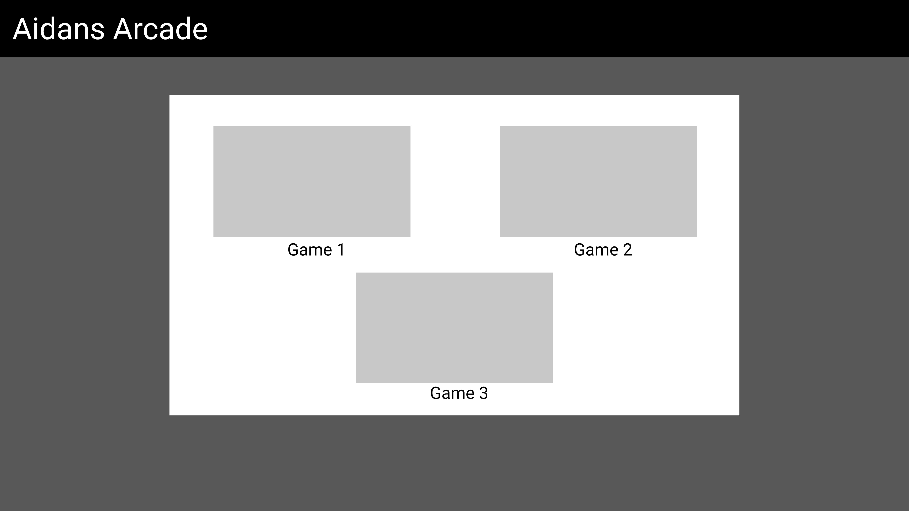
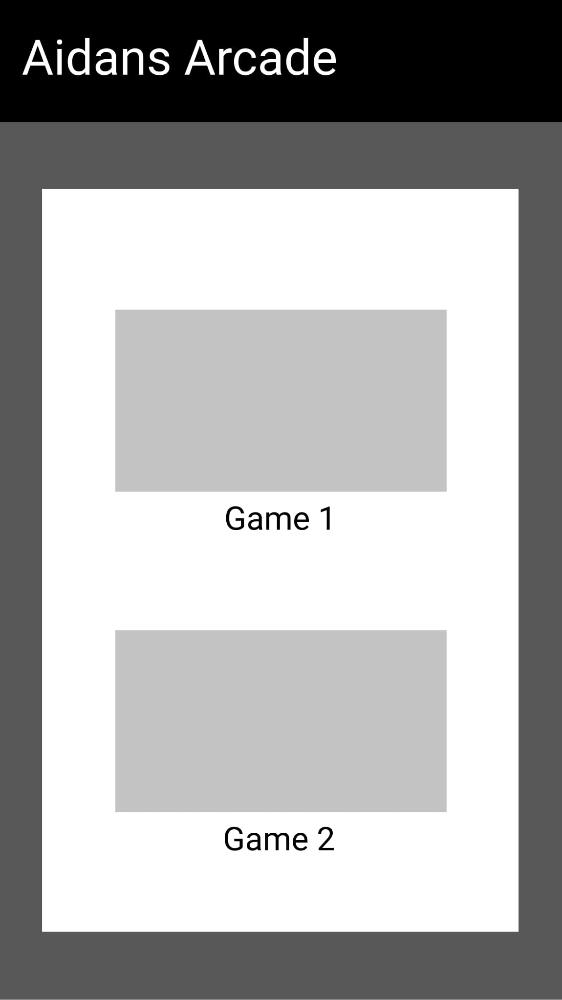
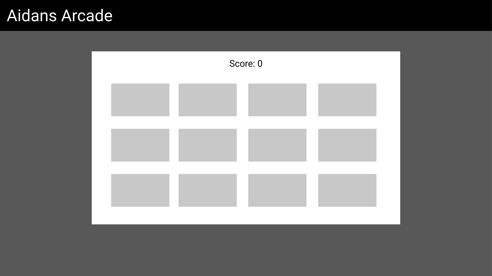
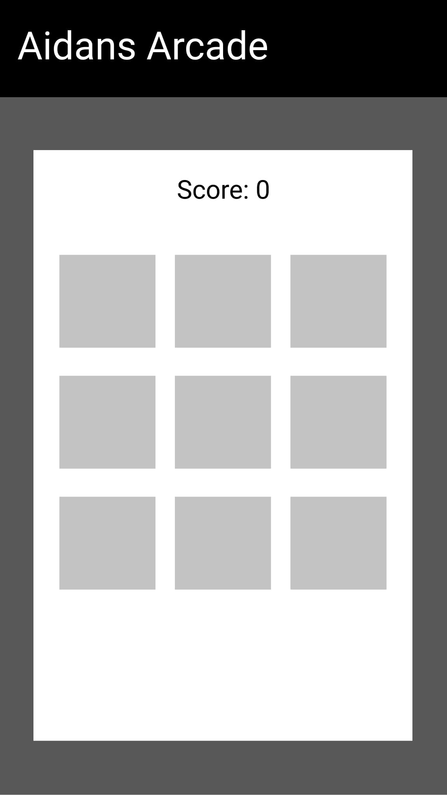
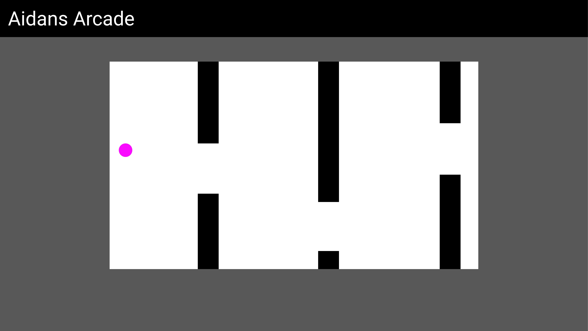
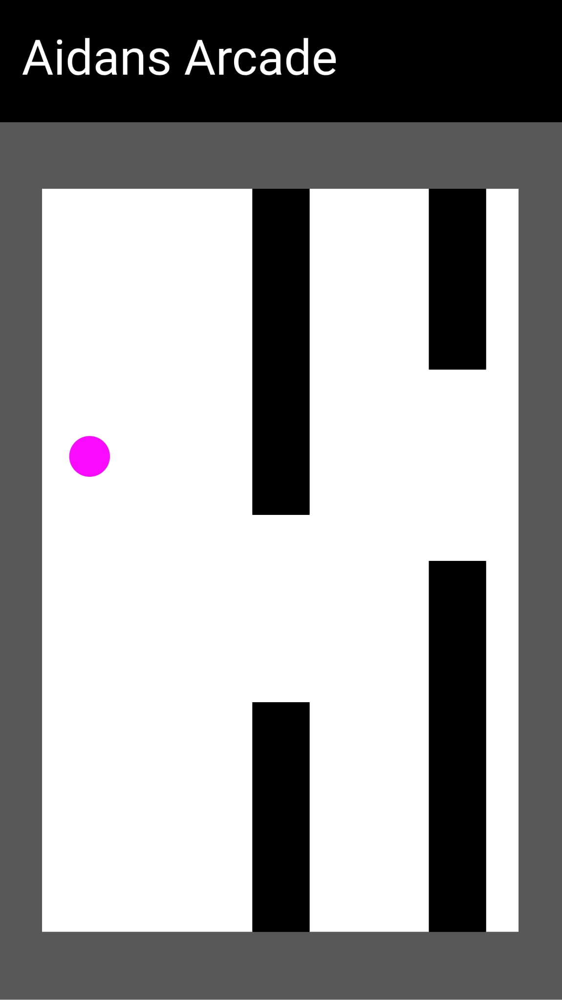

# Aidan's Arcade

## Code Institute: Milestone Project 2

-Mock Ups-

https://alienatedsoftware.github.io/Second-Milestone-Aidans-Arcade/

## Table of Contents

1. [Introduction](#Introduction)
2. [UX](#UX)
    1. [Ideal User Demographic](#Ideal-User-Demographic)
    2. [User Stories](#User-Stories)
    3. [Development Planes](#Development-Planes)
    4. [Design](#Design)
3. [Features](#Features)
    1. [Design Features](#Design-Features) 
    2. [Existing Features](#Existing-Features)
    3. [Features to Implement in the future](#Features-to-Implement-in-the-future)
4. [Technologies Used](#Technologies-Used)
     1. [Main Languages Used](#Main-Languages-Used)
     2. [Frameworks, Libraries & Programs Used](#Frameworks,-Libraries-&-Programs-Used)
5. [Testing](#Testing) 
     1. [Testing.md](TESTING.md)
6. [Issues and Bugs](#Issues-and-Bugs)
7. [Deployment](#Deployment)
8. [Acknowledgements](#Acknowledgements)
***

## Introduction

Aidan's Arcade -  Interactive Frontend Development - Code Institute

The goal of Aidan's Arcade is to act as an safe haven to save people from boredom by allowing them to play some quick games straight from the web. 
Entertainment is the primarily focus of what this project intends to deliever for the users. Giving users a choice on what game(s) they can play on that are very simple
and easy to control.

Aidan's Arcade was created with desktop users in mind, as the primarily target audience will be either students or workers that want to kill time during breaks or fulfill the
space they have created during their procrastination. Users will also have to option to play these games on handheld devices as well.

It has a clean, simplistic and minimal design to not make the screen too distracting, so the users can get straight into the game(s) with ease and focus.

This is my second of four Milestone Porjects that I must complete during the Full Stack Development Program over at Code Institute.
The primarily requirements for this milestone is to make an interactive front end website with the use of **JavaScript**.

[Back to top](#Aidan's-Arcade)
***

## UX

### Main Objectives

- To create an experience for users to be entertained with. Majority of the users will be on their computers, where they will easily be able to switch tabs to this virtual hub of games for users to play. 
- Allow users to choose between what games they want to play.
- Simplistic and easy navigation.
- To create an virtual arcard that is responsive to handheld devices.

### Ideal User Demographic

The ideal users of this website are:

- Gamers
- Work employees on break
- Teens/Students

### User Stories

The ideal user of this application would be someone who is procrastinating or on breaks during work/school. Where they will be entertained to kill their time, and relieve any stress they have put on themselves during their days of hard work. 

#### Gamers

1. As a gamer, I want to explore the enjoyment of being able to play fun and responsive games from the web.
2. As a gamer, I want to be able to choose from different games and explore some variety.

#### Work Employees

1. As an Work Employee, I want to be able to quickly kill time on my work breaks.
2. As an Work Employee, I want to distract myself from today's hard work and to relive stress.

#### Teens/Students

1. As a teen/student, I want to enjoy playing games.
2. As a teen/student, I want to be able to play locally with my classmates to have fun.

### Development Planes

In order to create an engaging website, the developer used their own passion and past memories of playing old flash games, to recreate that special feeling that users a-like would really enjoy spending their time on.

#### Strategy
This website will be focused on the following target audiences:
- **Roles:**
     - Gamers
     - Teens/Students
     - Work Employees

- **Demographic:**
     - 13 - 20+ year olds
     - High School kids - Employees
     - Gaming Community

- **Psychographics:**
     - Personality & Attitudes:
          - Youthful
          - Achieveous
     - Lifestyles:
          - Modern
          - Geeky

#### Home PC Wireframe

#### Home Phone Wireframe

#### Memory PC Wireframe

#### Memory Phone Wireframe

#### Flappy PC Wireframe

#### Flappy Phone Wireframe

###  Design

#### Colour Scheme

The main colours used throughout the website are a mixture of Dark grey, Black and White. All used with Bootstrap defleaut colours for simplistic and slick design.

#### Typography

- Heading/Logo - [VT323](https://fonts.google.com/specimen/VT323?query=VT323)
- Body - [Ubuntu](https://fonts.google.com/specimen/Ubuntu?query=Ubuntu)

#### Imagery

The imagery mostly consists of free SVG from "https://www.flaticon.com" and screenshots from game pages that are displayed on homepage.

[Back to top](#Aidan's-Arcade)
***

## Features

### Navigation Bar

- Logo, clickable which will always take you to the home page.

### Home

- Home screen consists of the playable games on screen, all clickable which will take you to the desired game page.

### Memory Game (card matching)

- A simple classic game of guessing which cards match, will be treated as a fun brain teaser when it comes to memory. All cards are randomly generated for new fresh experiences every replay.
- Alert system to tell the users whenever or not they have found a match.
- Scoring system that is displayed on the top of the screen, to keep track on how many matches the players have achieved.

### Flappy Game (flappy bird inspired)

- A responsive flappy bird inspired game, with randomly generated obtacles what the player must avoid. How far will you reach?
- An alert system for when the player crashes into the obstacle, that also includes the scoring on how many obstacles the user has passed through.

[Back to top](#Aidan's-Arcade)
***

## Technology used

### Languages Used
- [HTML5](https://en.wikipedia.org/wiki/HTML5 "Link to HTML Wiki")
- [CSS3](https://en.wikipedia.org/wiki/Cascading_Style_Sheets "Link to CSS Wiki")
- [JS](https://en.wikipedia.org/wiki/JavaScript "Link to JS Wiki")

### Frameworks Used
- [Bootstrap](https://getbootstrap.com/docs/4.4/getting-started/introduction/ "Link to Bootstrap page")
     - Bootstrap was used to implement the responsiveness of the site, using bootstrap classes.
- [Google Fonts](https://fonts.google.com/ "Link to Google Fonts")
    - Google fonts was used to import the fonts "Roboto Condensed" and "RocknRoll One" into the style.css file. These fonts were used throughout the project.
- [Font Awesome](https://fontawesome.com/ "Link to FontAwesome")
     - Font Awesome was used on all pages throughout the website to import icons for UX purposes.
- [Git](https://git-scm.com/ "Link to Git homepage")
     - Git was used for version control by utilising the GitPod terminal to commit to Git and push to GitHub.
- [GitHub](https://github.com/ "Link to GitHub")
     - GitHub was used to store the project after pushing
- [Figma](https://figma.com "Link to Figma homepage")
     - Figma was used to create the wireframes during the design phase of the project.
- [Am I Responsive?](http://ami.responsivedesign.is/# "Link to Am I Responsive Homepage")
     - Am I Responsive was used in order to see responsive design throughout the process and to generate mockup imagery to be used.

[Back to top](#Aidan's-Arcade)
***

## Testing

Based on the User Stories above, all users will be able to follow the flow of the website to find what they came for according to their stories.

Google developer tools was used manually to check and test the live project on all different screen sizes. Used multiple devices and feedback from family & friends who went to the deployed site on their devices.

[Back to top](#Aidan's-Arcade)
***

## Issues and Bugs

**Navbar / Matching Game Bug**
- Originally, there was a real graphical designed logo for this project. However it became groundbreaking when it came to the matching game, as the way the matching game works, its coded to be played around with images as the matching cards, however, this became problematic as the code would glitch and act as if the logo was one of the potentional card matching images, along side the real cards. This caused the logo to be replaced with a card, and broke the navbar completely. To fix this, a simple logo replacement was put into use, with an icon from fontawesome, instead of an image logo.

**Flappy Game Bug**
- This is by far the most complicated JS code I have done, there were a lot of problems along the way when it came to responsiveness.

[Back to top](#Aidan's-Arcade)
***

## Deployment

This website was developed in multiple editors, Gitpod and vsCode, and version controlling was utilised via local (git) and online (github) repository technologies.

Deploying this application was achieved through Github pages by:

* Selecting the Repository from my list in the Github Dashboard.
* Navigating to "Settings" and to the "Github Pages" section.
* From the "Source" section, click on the dropdown and select "main" branch from the associated list.
* Once "main" branch is selected, the page will auto-refresh and navigate the user to the top of the page with a visual ribbon display detailing, "Github pages source saved", indicating the success of the deployment.
* The link to the website can then be found under the "Github Pages" section, with a ribbon notification stating:
    "Your site is published at "https://<username>.github.io/<repo-name>/"

To clone the website:

Select the Repository from the Github Dashboard.
* Click on the "Clone or download" green button located above and to the right of the "Add file" button.
* Click on the "clipboard icon" to the right of the Git URL to copy the web URL of the Clone.
* Open your preferred editor/IDE and navigate to the terminal window.
* Type `git clone <paste-clone-url-here>` and press "Enter/Return" on your keyboard.
* This will create a clone of the project for you.

[Back to top](#Aidan's-Arcade)
***

## Acknowledgements

All credits & References go the https://www.freecodecamp.org/ and it's members.

Thank you to my mentor, and all students over on the slack community for code insitite for all the helpful tips given to tackle my work.

References used;

- https://www.youtube.com/watch?v=lhNdUVh3qCc
- https://www.youtube.com/watch?v=PkZNo7MFNFg

[Back to top](#Aidan's-Arcade)